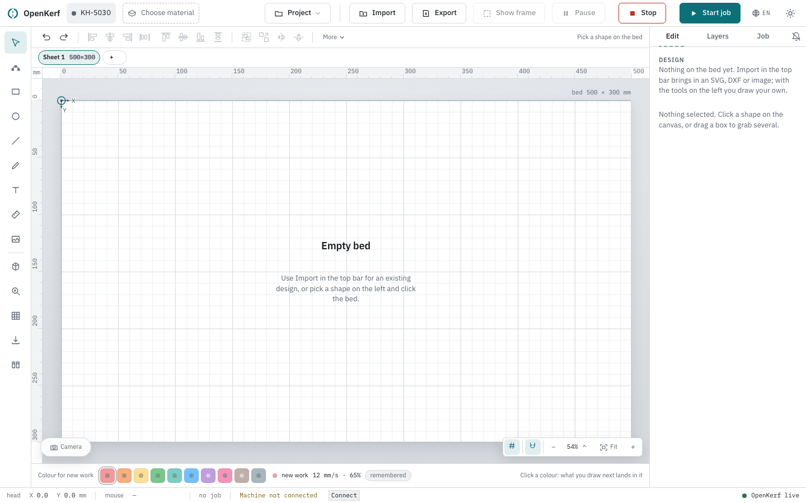
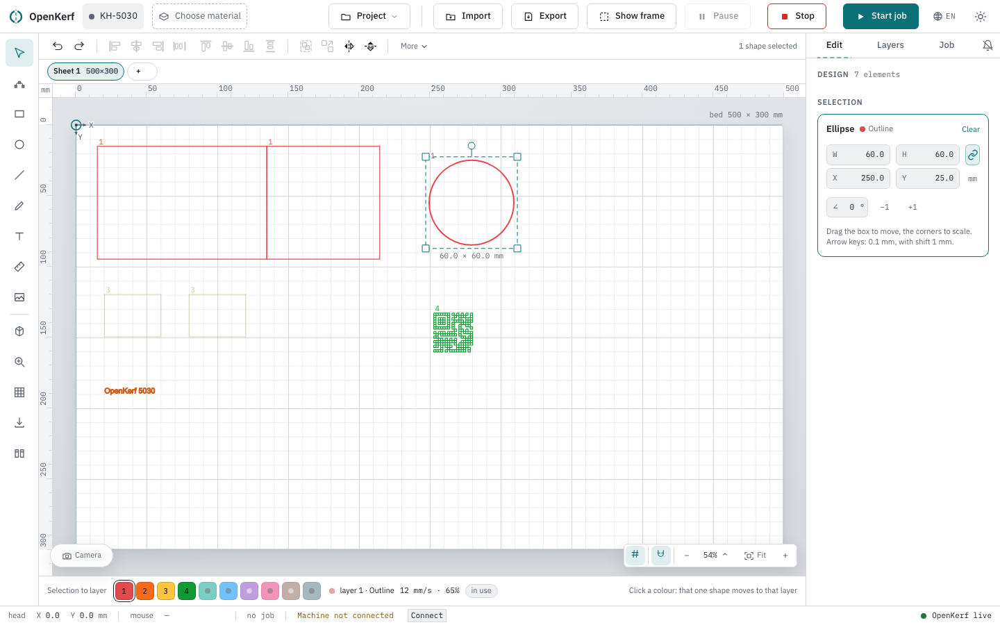
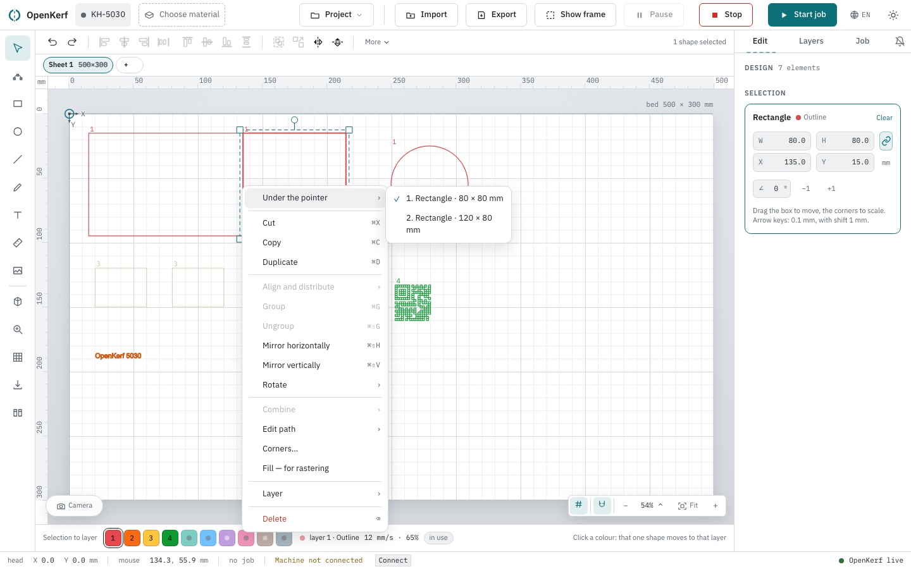
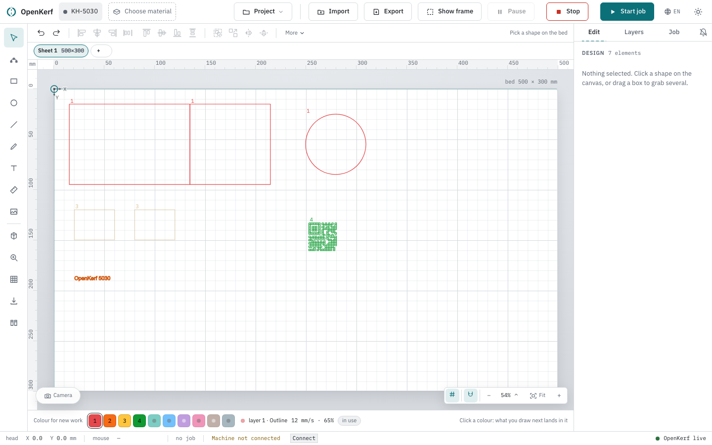
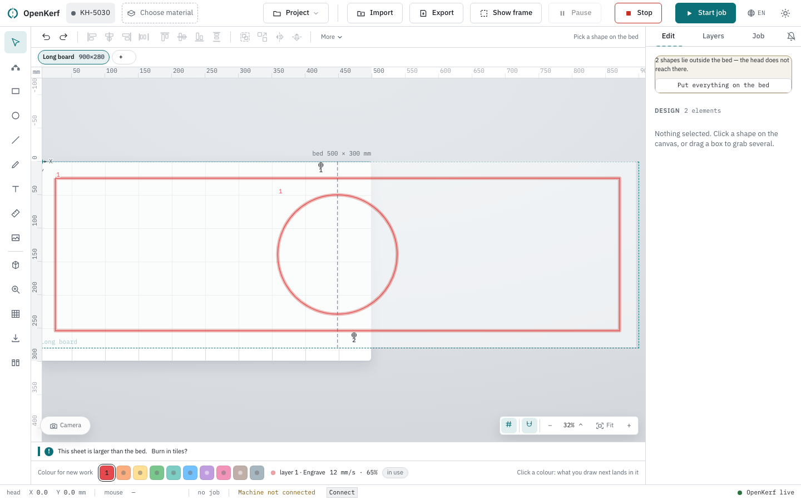
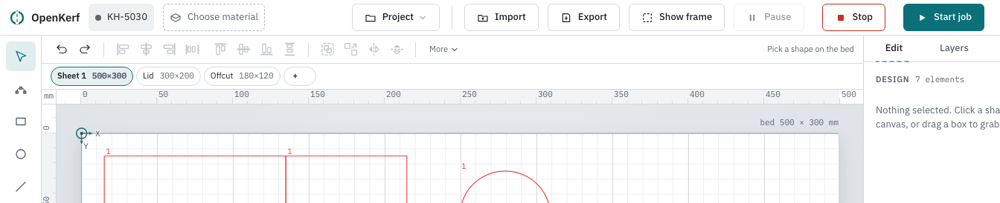

# The bed: drawing, selecting and sheets

The bed is the large drawing area in the middle of the window. It shows your machine's
work area to scale, the sheet of material lying in it, and everything you have drawn or
imported. This page covers the tools on the left, how you pick things up and change them,
how the view moves, and how sheets work.

A fresh bed says **Empty bed**, with "Use Import in the top bar for an existing design, or
pick a shape on the left and click the bed." That block disappears as soon as there is
work on the bed, and also while a job is running.

## What is drawn on the bed

- The **bed rectangle**, at the size of your machine's work area, with its measure beside
  the top right corner: `bed 500 × 300 mm`.
- **Rulers** in millimetres along the top and the left, with `mm` in the corner between
  them. Zero is the corner of the bed. The scale runs on past the bed as well, in lighter
  figures and with negative numbers to the left of and above it, so you can read off how
  far a shape lies outside the work area. A band on the ruler marks how far the bed
  reaches. While you move the pointer, a coloured tick on both rulers follows it.
- A **grid**, at the same step as the ruler, with a finer subdivision that disappears when
  it would fall too close together.
- The **sheet** — the piece of material you put in — as a dashed rectangle in the top left
  corner of the bed with its name in the corner, whenever it is smaller than the bed.
- The **origin mark** at 0,0: two short arrows marked X (to the right) and Y (downwards),
  the directions the machine counts in. This mark never moves.
- If you have set a zero point of your own, a small cross marked `0`, and a dotted frame
  showing where the work will land, labelled **burns here**.
- The **laser head**, as a circle with a crosshair through the whole bed. Its position is
  read out as "Laser head at 120.5 by 80.0 millimetres", or "Position of the laser head
  unknown" when the machine does not report it.

## The tools on the left

The rail on the left holds eight tools; one is active at a time.

| Tool | What it does |
| --- | --- |
| **Select** | The resting state: pick things up, move, scale, rotate. |
| **Nodes — pick a shape first, then drag the points** | Drag the individual points of one shape. |
| **Rectangle** | Click the bed and a 20 mm square is placed there. |
| **Circle** | Click the bed and a circle 20 mm across is placed there. |
| **Line** | The first click sets the start, the second the end. The line follows the pointer in between. |
| **Pen — click points, Enter finishes** | Click point after point. Enter finishes it open; clicking back on the first point closes it; Escape throws away what you had. |
| **Text** | Click the bed and the **Place text** window opens, with the text itself, **Height (mm)**, **Letter spacing** and **Alignment**. |
| **Measure** | Two clicks; the distance in millimetres stays on the bed until you start again. |

Below the tools sit **Place image** and the buttons that open a window of their own:
**Generators — grid, circle, polygon, box, QR**, **Search clipart in public collections**,
**Test grid**, **Presetariat — shared settings** and the material library.

Placing a shape snaps just as dragging does, so a new rectangle lands on the grid line you
put it on and not 3.7 mm beside it.

**When it goes wrong.** Every tool except Select needs an edit token. Without one the
button is dimmed and its tooltip reads, for example, "Rectangle — requires a token".

## Selecting: an outline is a line, not a surface

This is the part that surprises people who come from a drawing program.

The way a laser cutter works, an **outline is a line**. So you click a shape's contour, not
its middle. The inside of a rectangle is not clickable, and that is on purpose: anything
you draw *inside* that rectangle — a hole, a label, a part nested to save material — stays
reachable instead of being swallowed by the shape lying over it. There is a hit zone a few
pixels wide around the contour, so you do not have to hit a hairline exactly.

A **filled shape is caught on its face**. For a filled shape the surface is the work — that
is what a raster layer burns — so clicking anywhere on it selects it. Images work the same
way: the whole picture catches the click.

Other ways to select:

- **Drag a box** over the bed with Select active. Everything the box *touches* is selected;
  you do not have to enclose a shape completely. Hidden shapes are left out.
- **Shift+click** adds a shape to the selection, or takes it out again.
- **Escape**, or a click on the empty bed, clears the selection.
- A shape can also be reached with the keyboard: tab to it and press Enter or space.

### A pile under the pointer

Shapes lie on top of each other more often than you would think — a copy that did not
move, a cut-out over its panel, two rectangles of the same size.

A plain click takes the top one. **Alt+click walks down the pile**: whatever is selected
now, the next one below it is taken, and from the bottom it starts again at the top. Where
you are is said in words beside the selection count above the bed: "Shape 2 of 4 under the
pointer — Alt+click for the next." That line disappears again after a few seconds.

If you would rather look than click through, **right-click** the shape. The menu then opens
with **Under the pointer** at the top: a numbered list, top shape first, of everything under
the cursor, with the measure behind each name — `2. Rectangle · 60 × 40 mm`. The numbers are
the same ones the Alt+click line counts with, and the row of the shape that is selected now
carries a tick. Pick a row and that shape is selected. The list only appears when there is
really something to choose between: with one shape under the pointer it is left out.

## Changing what you have selected

The selection is a dashed frame, drawn a few pixels clear of the shape so the layer colour
underneath stays readable. Its measure stands underneath it, live: `60.0 × 40.0 mm`.

- **Move**: drag anywhere inside the frame. Or use the arrow keys — 0.1 mm a press, 1 mm
  with shift held.
- **Scale**: drag one of the four corner handles. The opposite corner stays put.
- **Rotate**: drag the round handle on the stem above the frame. Hold shift and it locks to
  steps of 15 degrees. A turn of less than half a degree is treated as a tremble and
  ignored.
- **A line** has no corner handles: you grab it by its two end points, and the length in
  millimetres shows while you drag.
- **Nodes** puts the shape's own points on screen; drag one and the shape follows.

Only one command goes to the engine, when you let go. Until then what you see is a preview,
shape and all.

**When it goes wrong.** The Nodes tool says why nothing is happening, in a line under the
bed:

- "Nodes works on one shape. Click one on the bed."
- "Nodes works on one shape at a time; 3 are selected. Click just one of them."
- "This shape has no loose points. Make it a path first with Combine, in the panel on the
  right."

## Snapping, and what Alt does to it

While you move, scale, draw or drag a point, things lock onto their surroundings: the grid,
the edges and centre lines of the other shapes, the edges and the middle of the bed, and
the edges and the middle of the sheet. Left, right, top and bottom are decided
independently, so a shape can line up on the left with one neighbour and on the top with
another.

You see **what** it locked onto: a guide line appears, running from the shape you are moving
to the thing it lined up with, with a short word beside it — `grid`, `edge`, `centre`, or a
word for the bed or the sheet edge. A grid, bed or sheet line has no counterpart and runs
across the whole bed.

The reach is nine screen pixels, not a fixed number of millimetres. Zoomed in to 400% the
snapping is four times more precise by itself, which is what you want when you are aiming.
When the fine grid is too close together to see, snapping uses the main step only — locking
onto a line that is not drawn is a riddle.

**Alt inverts it for one movement.** With snapping on, holding Alt lets you place something
freely; with snapping off, holding Alt turns it on for that one drag. The magnet button in
the zoom bar bottom right switches it for longer, and remembers your choice between
sessions. Its tooltip says which way it stands: "Snapping is on — hold Alt to skip it for
one move" or "Snapping is off — hold Alt to use it for one move".

Alt has two other jobs on the bed, and they do not clash: Alt+click on a shape goes deeper
into the pile (that is a click without movement), and Alt+drag on the empty bed pans the
view.

### Right-click on the empty bed

A right-click on a shape is about that shape; a right-click on empty bed is about
the view and the whole design. It gives, in this order: **Paste here** ("The
top-left corner lands where you clicked"), **Select all** and **Clear selection**;
then, under the heading **View**, the four zoom states — **Fit everything in
view**, **To the selection**, **The whole bed** and **100 % — actual size**; then
two switches, **Snap to grid and shapes** and **Layer numbers next to the
shapes**; and at the bottom **Put everything on the bed**, which pulls the whole
design back inside the bed, "Including what lies off screen and cannot be
clicked". That last one is the only way to reach a shape you have dragged out of
sight and can no longer click.

Every row, with its shortcut and the reason it can be greyed out, is in
[Reference](reference.md#right-click-on-the-canvas).

## Moving the view

- The **wheel** zooms, towards the point under the cursor.
- **Hold space** and drag to pan; the cursor becomes a hand. The middle mouse button and
  Alt+drag do the same.
- The **zoom bar** bottom right has minus, plus, the current scale as a percentage, and a
  **Fit** button ("Fit everything in view (3)").
- The percentage is a real scale: at 100% a 10 mm line on the bed is 10 mm on your screen.
  Click it and a menu offers **Fit everything in view**, **To the selection**, **The whole
  bed** and **100 % — actual size**, plus fixed steps of 25, 50, 100, 200 and 400 %.
- On the keyboard: `3` fits everything, `2` goes to the selection, `0` shows the whole bed,
  `1` is actual size, `+` and `-` step in and out. "To the selection" falls back to fitting
  everything when nothing is selected, so the key always does something sensible.

## Layer numbers beside the shapes

Each shape is drawn in the colour of the layer it belongs to, and beside it stands that
layer's number — the same number as in the layer list and in the pre-flight. Colour alone is
not enough to tell ten layers apart, especially not on a 1.2 pixel line or for a
colour-blind eye, so the number is the safety net.

The number is left off shapes too small on screen to carry it, because fifty figures make
the bed unreadable; zoom in and they appear. What you have selected yourself always gets
its number, at any zoom level.

The button with the numbered-lines icon in the zoom bar turns them off and on. Its tooltip
says "Layer numbers next to the shapes are on" or "… are off".

Two other renderings you will meet: a shape in **grey dotted** lines is in no layer at all
and will not be burned; a shape drawn **thinner and half transparent** is in a layer that is
set not to burn.

## While the machine is working: the head trace

During a job the path the head really travelled is drawn on the bed as one thin line under
your design, with the last stretch brighter — that is where it is now. Around the head
marker a ring fills up with the progress.

It is a trace, not a kerf. The machine reports where the head is, not whether the laser was
on, so the jumps between shapes are in the line as well. A strip under the bed says so in
words: "Trace of the head — measured, including the jumps between shapes." followed by
"62% shows as a ring around the head."

## Off the bed, off the sheet

A shape that crosses an edge lights up on the bed with a glow under it, and a strip under
the bed says what is wrong. Two different problems, two sentences:

- "One shape lies outside the bed — the head does not reach there." (or "3 shapes lie …")
- "One shape lies outside Sheet 1 — there is no material there."

Shapes that are not going to be burned anyway — in no layer, or in a layer set not to burn
— are left out of this count. A false alarm teaches you to ignore the real one.

If the **sheet itself** is bigger than the bed, that is not a mistake but a way of working.
The strip then reads "This sheet is larger than the bed." with a button, **Burn in tiles?**

## Sheets

A sheet is the piece of material you put in the machine — not the bed. A project can hold
several, and each is a document of its own: what you see on the bed is exactly what gets
burned.

The row of tabs above the bed is the sheet bar. Each tab carries the sheet's name and its
size (`300×200`); hovering adds the material, if one is filled in. Click a tab to switch to
that sheet. The **+** at the end adds one ("Add a sheet").

Click the tab you are already on and a small editor opens under it, with:

- **Name**
- **Width** and **Height** in millimetres
- **Material** — the button shows the material and thickness of this sheet, or "not filled
  in". It opens the same material window as the chip in the top bar; the choice is made in
  one place only.
- **Remove the sheet**, and **Done** to close the editor.

**When it goes wrong.** Removing a sheet that has work on it asks first: "Sheet 2 holds 7
elements. Removing it throws that work away — this cannot be undone.", with the button
**Remove the sheet and 7 elements** beside Cancel. The count is asked of the server at that
moment, not read off the screen, so a sheet you have just switched to is never mistaken for
an empty one. An empty sheet goes without a question. The last sheet cannot go at all — the
button is dimmed and reads "A project has at least one sheet".
