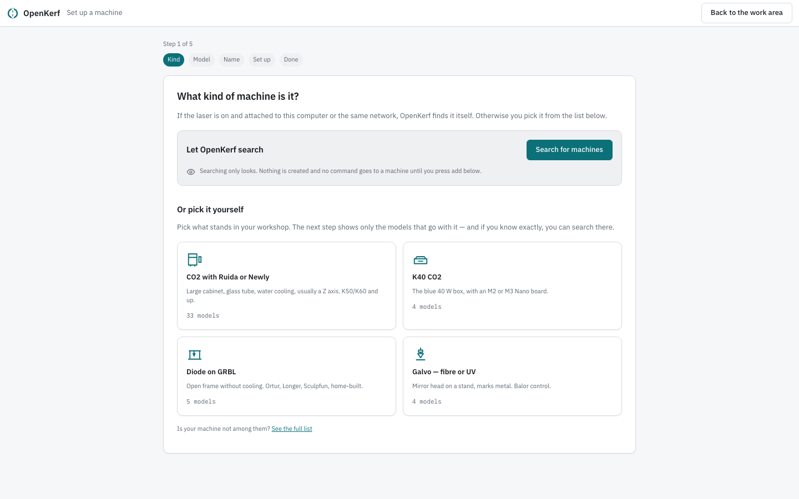
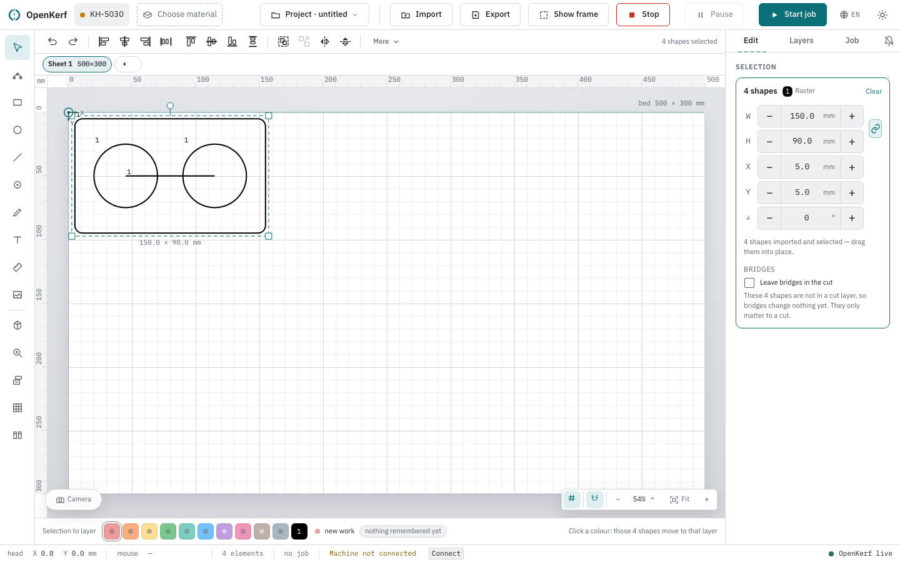
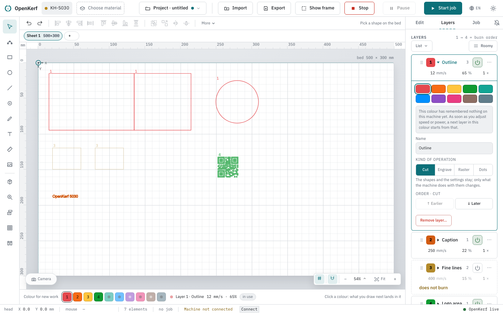

# Getting started

This page walks the road from a fresh installation to the first burn: telling
OpenKerf which laser stands in your workshop, saying what is lying on the bed,
getting a drawing onto it, giving that drawing a speed and a power, and checking
the last screen before the head moves.

Read it in order. Every step here is one you actually have to walk; nothing is
skipped and nothing is out of sequence. It ends with what to do when the machine
is not answering, because on the first day that is the most likely thing to
happen.

## First start

A fresh installation has no machine yet, and OpenKerf says so before it shows you
anything else. While it is still asking the server what exists, a single line
appears: "Just checking which machine is there…".

Then the welcome card:

The heading is "No machine has been set up yet." and the lead explains why this
comes first: "Without a machine the canvas does not know how big your bed is.
Four steps, about a minute — and everything can still be changed later."

Under it are the four things the wizard will ask — **Kind**, **Model**, **Name**
and **Work area** — so you know how far it goes before you start.

There are two ways on. **Set up a machine** goes to the first question. **Look
around without a machine** opens the work area anyway, with the warning printed
beside it: "Drawing works, burning does not — the bed sizes and the status are
then those of a default device the engine invents itself." Looking around lasts
for that session only; the next start asks again.

## Setting up the machine

The wizard has five screens and a step bar that counts them ("Step 4 of 5" in the
picture below). Each screen is its own address, so the back button, a bookmark and
a refresh all do what you expect.

**Kind.** "What kind of machine is it?" Four kinds, in workshop language rather
than board names: "CO2 with Ruida or Newly" ("Large cabinet, glass tube, water
cooling, usually a Z axis. K50/K60 and up."), "K40 CO2", "Diode on GRBL" and
"Galvo — fibre or UV". Each carries a one-line description of what it looks like.

If the laser is switched on and attached, you do not have to know the answer.
**Search for machines** looks over USB, serial and the network; while it runs it
counts ("Searching… 8s") and explains that "USB and serial ports are checked in a
moment; the network costs a few seconds, because every address in your subnet gets
one question." Nothing is created by looking: "Searching only looks. Nothing is
created and no command goes to a machine until you press add below."

What it finds is labelled with how sure it is — **Answered** ("This device
answered by itself."), **Probably** ("Recognised by the control chip, but the
device said nothing back.") or **Guess** ("This chip sits on more than one kind of
machine. Check the model yourself.") — each with an **Add this one** button.

> **When nothing is found.** The screen says "Nothing found" and then "Is the
> machine on and the cable in? Otherwise pick it below yourself — that works just
> as well." Picking the kind by hand is not a fallback; it is the same road.

**Model.** "Which model?" — the list comes straight from the engine ("This list
comes from MeerK40t itself.") and shows only the models that go with the kind you
chose. There is a search field, "Search by brand or type…", and a way out if your
machine is not there: **Show all models**.

**Name.** "Give the machine a name". When the model is known the lead names it —
"This is how you recognise it in the top bar: “K50/K60-CO2-Laser
(Ruida-Controller)”." — and otherwise it is the short form, "This is how you
recognise it in the top bar." Anything you will recognise at a glance will do; the
name in the pictures here is KH-5030. The buttons are **Back** and **Create**.

OpenKerf catches a name that is already taken before the machine is made. The
picture below is that moment: under the field it says "There is already a machine
called “KH-5030”. In the top bar they cannot be told apart.", with a link beside
it that offers a name that is free — **Make it “KH-5030 (2)”**.

**Set up.** The work area. "How big is the bed?" with the warning that matters
most on this screen: "Measure the work area, not the outside of the case. This
becomes the bed on your canvas — if it is wrong, OpenKerf thinks there is room
where the head does not go." Width and height in millimetres, and a preview of the
bed beside the fields.

![The wizard's fourth screen, "How big is the bed?", with Width (mm) 500 and Height (mm) 300 and a drop-down "Where is 0,0?" set to "As the machine says itself"; under it the fieldset "The laser itself" with Kind of laser set to "CO2 with a glass tube", Tube power 80 W, the tick box "I am not sure how powerful my tube is" and Lens 50.8 mm; then "What does this machine have?" with the boxes for a Z axis and Autofocus, a collapsed section "More of this machine", and the buttons "Skip" and "Save and finish".](images/04-setup-settings.png)

Then "Where is 0,0?" — the choices are "As the machine says itself", "Top left",
"Top right", "Bottom left", "Bottom right" and "Centre", with the explanation "The
corner the head goes to when you send it home. If you do not know, leave what the
machine says itself."

Then **The laser itself**, which is two facts about the machine that are nowhere in the
engine and that OpenKerf cannot work out for you:

> What kind of light this machine makes, and how much of it. OpenKerf needs both before it can tell which presets other people have measured would suit your laser.

**Kind of laser** arrives filled in — worked out from the model you picked a screen ago —
with the six answers "CO2 with a glass tube", "CO2 with an RF metal tube", "Diode",
"Fibre", "UV" and "I do not know". The hint says how far to trust the prefill:

> Filled in from the model you picked. A glass tube and an RF metal tube cannot be told apart from that, so correct it if you know better.

**Tube power** in watts is the one nobody else can know:

> The number on the tube or on the invoice. It decides which settings can be a starting point for this laser: the same percentage on twice the power chars and burns through.

If you do not know it, say so. The tick box **I am not sure how powerful my tube is**
is a real answer, not a way of skipping the question, and it says what it costs:
"Then OpenKerf matches on the kind of laser alone, and says so on every preset it offers
you." Below 1 W or above 1000 the field is refused: *A tube power between {min} and {max} watt,
please.* **Lens** in mm is optional.

These two are what decide whether a preset somebody else measured can be a starting
point for your laser — see [The material
library](library.md#starting-points-from-the-shared-catalogue). You can fill them in later
in the material library, under the machine profile you are working on, but this is the
cheapest moment.

Then "What does this machine have?" with two boxes: "A Z axis (height-adjustable
bed or head)" and "Autofocus". Below that a folded section, "More of this
machine", holds the engine's own fields; you only need those for a mirrored or
rotated machine. **Skip** and **Save and finish** both go on.

**Done.** The last screen says "<machine> is ready." and then the sentence worth
following literally: "The connection to the laser is only made at the first job.
Do that first time with the lid open and without a workpiece — then you see whether
the head moves as you expect without anything being able to burn."

If the sheet you have does not match the new bed, it offers "Does your sheet come
along to this bed?" with **Set the sheet to the bed size** or **Leave it** — and
the reminder that a sheet is the piece of material you put in, not the bed itself.

**And an offer, on the same screen.** A machine that has just been created has no settings,
so the last step says so and offers to fetch some that would suit it:

> This machine has no settings yet.

with the machine's name, the kind of laser and the tube power read back, a count of what
your library holds for it, and a **Show what would suit this laser** button. Nothing goes to
the network until you press it. **Not now** puts the offer away for good on this machine.

The same card is at the top of the material library, and the whole of it — what the
catalogue is, what the tags on a row mean, how the credit travels and how to take an import
back — is on [The material
library](library.md#starting-points-from-the-shared-catalogue). It is worth two minutes
here: the second step of the list below this one is giving your drawing a speed and a power,
and this is where those can come from if you have not burned a board yet.

Out of the wizard: **Another machine** or **To the work area**.

## Your sheet and its material

The work area opens with an empty bed, drawn to scale, with rulers in millimetres
along the top and the left, and its size printed in the corner ("bed 500 × 300
mm"). In the middle it says "Empty bed" and, under that, "Use Import in the top
bar for an existing design, or pick a shape on the left and click the bed."

A **sheet** is the plate you put in the machine, and a project can hold several. The
bar above the canvas has one tab per sheet with its name and its size; the **+**
adds another.

Clicking the tab you are already on opens its fields: **Name**, **Width** and
**Height**, in millimetres, plus a row showing the material. Set the width and height to the
piece of material actually lying on the bed, not to the bed — that is what the
shapes-outside-the-sheet warnings are measured against.

Sheets in full — the editor, moving work between them, what happens when you
remove one — are in [The bed](canvas.md#sheets).

The material is chosen once, in the top bar. The chip beside the machine name
reads **Choose material** while nothing is filled in; clicking it opens the window
"Material of this sheet". It states what it applies to — "Applies to {sheet} —
{size}. Every sheet keeps its own material, so thin and thick can be in one
project." — and takes a material and a thickness in millimetres.

Fill it in. Without it, "Without a material the library shows everything and the
preflight cannot see whether a preset belongs to this sheet." If the library has
nothing for that material yet it says so: "No presets in the library for this
material yet. A test grid is the shortest way there."

## Getting a design onto the bed

Two roads, and they can be mixed on one sheet.

**Draw it.** The tool rail on the left holds **Select**, **Nodes**, **Rectangle**,
**Circle**, **Line**, **Pen**, **Text** and **Measure**, one active at a time.
Pick a tool and click the bed. With **Select** you click a shape to select it,
drag a box to grab several, drag the box to move, its corners to scale, the handle
to rotate; the arrow keys move 0.1 mm, and 1 mm with shift held.

> **When a tool is greyed out.** Every tool except Select needs write access, and
> the tooltip then reads "{label} — requires a token". The token is filled in on
> the Job tab of the right-hand panel, under "Token for write actions"; the engine
> prints it in its own window when the API starts.

**Import it.** **Import** in the top bar reads a file into the sheet you are
working on: SVG, DXF, RD, EGV, G-code, LBRN, EZD, XCS and the common image
formats.

Importing **adds**. It does not empty the bed, and nothing you already drew is
thrown away — a sheet is a plate, and a plate holds more than one part. What
arrived is selected straight away so you can drag it into place, and the panel
says how much came in: "4 shapes imported and selected — drag them into place."

Note the difference from **Project → Open project…**, which is the other thing
entirely: "Opening replaces the whole project: the design, all {n} sheets and the
material come from the file." That one asks before it throws work away. Import
never has to.

### Keeping the work

**Project → Save project** writes the lot into one file — "Design, sheets,
materials and machine profiles in one file." That is the file **Open project…**
reads back.

**Export** beside it does something narrower: "Save this sheet as SVG" — one
sheet, as a drawing, for another program. It does not carry the layers, the
material or the machine.

If you leave a design behind, OpenKerf offers it at the next start under **Work
from an earlier session**: "There is an automatically saved design from {when}.
Restore it?", with **Restore**, **Not now** and **Discard**. It is a safety net,
not a substitute for saving.

## Giving the shapes a layer

A shape on the bed does not burn until it sits in a layer. The **Layers** tab of
the right-hand panel says it plainly when there are none: "No layers yet. A layer
is an operation — cut, engrave or raster — with a speed and power of its own. Make
one below; then select a shape to put into it."

**+ Add layer** at the bottom of the list unfolds the four kinds: **Cut**,
**Engrave**, **Raster**, **Dots**. Each layer row shows its speed in mm/s, its
power in per cent and its number of passes, and you type over them there. Opening
a row gives it a **Name**, its **Kind of operation** ("The shapes and the settings
stay; only what the machine does with them changes.") and its place in the order.

The numbering above the list is the burning order: "1 → 4 = burn order".

The quickest way to put shapes in a layer is the colour strip along the bottom of
the canvas. With nothing selected it reads "Colour for new work" and "Click a
colour: what you draw next lands in it". With a selection it becomes "Selection to
layer" and "Click a colour: those 4 shapes move to that layer".

If you do not know what speed and power your material wants, do not guess: the
wizard's own advice is "Not sure of the material? Burn a test grid first." A layer
switched off shows the tag "does not burn", and a shape in no layer at all is
labelled "This shape does not burn".

Every setting a layer carries, and the four ways of getting a shape into one, are
in [Layers](layers.md). Burning a board of test squares to find those numbers is
in [Test grids](test-grid.md).

## The pre-flight

The pre-flight stands open the whole time. It is the **Job** tab of the
right-hand panel, under the heading "Getting ready", and it is the one screen that
shows everything the machine is about to do. You do not have to press anything to
see it, and it follows your drawing: change a shape and the estimate is worked out
again.

**Start job** in the top bar does not start anything. It switches to that tab and
arms the job — see "Burning" below.

![The Job tab showing a small picture of the sheet with the work in it, "Sheet 1 500 × 300 mm", "work 295 × 176 mm", a note that two shapes sit in no layer that burns, "Estimated time 1:19", the row "Material" reading "not filled in for this sheet", a yellow warning that the machine is not responding, a second warning that three layers use presets that were not verified, below it the table of layers with mm/s, %, passes and source running on under the foot of the panel, and there the strip that carries the list "Run through this" — Lid closed, Extraction and air assist on, Workpiece is clamped and flat — above a "Show frame" button on its own line and a green "Start job 1:19" with a narrower arrow button joined to its right-hand end.](images/12-job-preflight.png)

From top to bottom it holds:

- a picture of the sheet with your work on it, its size, and the size of the work
  itself — plus a note about anything that will be skipped, for example "2 shapes
  sit in no layer that burns — dashed grey above. The machine skips them.";
- **Estimated time**;
- **Material** — the sheet's material, or "not filled in for this sheet";
- the zero point, when you have set one;
- a table of the layers with their speed, power, passes and where those numbers
  came from;
- the list **Run through this**: "Lid closed", "Extraction and air assist on",
  "Workpiece is clamped and flat" — in the strip at the bottom of the panel, above
  the start button, where it cannot scroll away from it.

Read the source column. A preset that was not measured on a test grid says so,
and the panel adds it up: "3 layers use presets that were not verified on a
test grid. On unknown material: try a scrap first."

Each part of the panel, and what it does while a job is running, is in
[Burning](job.md).

> **When there is nothing to burn.** Instead of the checklist you get "There is
> nothing to burn" and "The bed is empty, or everything on it sits in a layer that
> does not burn. Draw or import something, give it a layer, and come back here."
> There is no start button on that screen, because there is nothing to run
> through.

> **When something is already running.** The pre-flight tells you where you are in
> the row: "There are already {n} jobs in the queue; this one goes behind them."

## Burning

Three buttons, and the order matters.

**Show frame** sends the head around the outline of your work with the laser off.
Its own tooltip says what it does: "Send the head around the outline of your work
— the laser stays off". Use it every time; it costs seconds and it is the only
check that compares your drawing with the actual plank. The wizard's last screen
puts the reason plainly: "The head traces the outline without burning. That is how
you see whether your workpiece is in the right place."

The button sits in two places — in the top bar, where it is always within reach,
and in the footer of the un-armed pre-flight, beside **Start job**. Once the job
is armed the footer shows **Cancel** and **Start now** instead, so if you want to
frame after arming, use the one in the top bar.

> **When the frame is refused.** The tooltip says "Nothing is on the bed, or this
> machine cannot move", or, when the server is unreachable, "Running the frame has
> to wait until the server is back."

Then **Start job**. That first press arms the job: the footer becomes **Cancel**
and **Start now**, and only **Start now** sends it. No single click burns
anything. Pressing **Start job** in the top bar does the same arming, and takes
you to the Job tab so you can read the pre-flight before the second press.

**Stop** is in the top bar the whole time, running or not, and it answers to the
keyboard as well: ⌘ + . on a Mac, Ctrl + . elsewhere. Pressed with nothing
running it does not go to waste — its tooltip then reads "Nothing is running —
this aborts a job the moment one starts". Those keys work anywhere in the app, as
long as this window is in front. Learn where that button is before you press
**Start now**.

While it runs, the panel follows the job rather than the controls. "Burning" comes
with "Stay with it and keep the stop button within reach." **Pause** stops the head
without losing the job ("Stop the head without losing the job"); **Resume** carries
on where it left off. **Stop** aborts.

The trace of the head is drawn on the canvas as it goes — measured, including the
jumps between shapes — so you can see what it has actually done, not what it was
supposed to do.

## When the machine is not connected

This is normal on the first day, and the app is explicit about it rather than
silent.

The strip at the bottom of the window is where the truth lives, and it is where
the connection is written out in words. It reads one of four things: **Machine
unknown** (this page is not talking to OpenKerf, so nobody can say), **Machine not
connected**, **Connection unknown** or **Connected to the laser**. Where the
driver has a command for it, a **Connect** button stands next to that text, and
its tooltip promises "Open the connection to the machine. This moves nothing."

The machine chip at the far left of the top bar carries the state as a coloured
dot beside the machine's name; the word itself is in the chip's tooltip, together
with the bed size — **Offline**, **Not connected**, **Ready**, **Busy**,
**Paused** or **Alarm**. Hover the chip to read it.

Clicking the chip takes you to the machine setup — except while a job is under
way. Then it is not a link, and says so: "The machine is burning. The setup opens
once the job is done — the stop button stays here." The setup screens carry no
stop button and no shortcut, so leaving the work area during a job would take both
off the screen at the one moment you might need them.

You can start a job anyway. The pre-flight warns what will happen: "The machine is
not responding. This job goes into the queue and only starts once the connection
is there — switch it on or check the cable." So a silent machine after pressing
start is the connection, not the job.

Some drivers do not report whether anything is listening. The strip then says
"Connection unknown", and hovering that text explains why: "The engine is running,
but this driver does not report whether a machine is attached. You will notice on
the first job: it stays in the queue if nothing is listening."

> **When OpenKerf itself is gone.** A card appears: "No connection to OpenKerf"
> and "The server is not responding. What you draw or set now does not arrive, and
> the values below are the last ones we saw." If a job was running, it adds the
> line that matters: "The machine carries on. Stopping is only possible with the
> button on the machine itself now." There is a **Try again now** button, and it
> retries by itself as well.

> **Before you disconnect on purpose.** OpenKerf asks, because reconnecting is not
> guaranteed: "Disconnect? Reconnecting afterwards does not always work; sometimes
> only a restart of the server helps."

Connecting, disconnecting and the jog controls beside them are covered in
[Burning](job.md#connect-and-disconnect).
