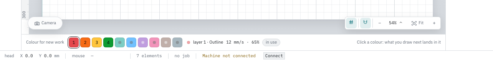

# Layers: what the laser does with a shape

A shape on the bed is only a drawing. What the machine does with it — cut it
through, engrave a line, sweep an area away — is decided by the layer it sits in.
This page covers the Layers tab in the panel on the right, the colour strip under
the bed, and every setting a layer carries. Some of those settings only appear
when your machine can actually do them; that is said where it applies.

## What a layer is

A layer is one operation with settings of its own: a speed, a power, a number of
passes and a colour. There are four kinds, and the panel names them **Cut**,
**Engrave**, **Raster** and **Dots**. Cut and engrave follow the outline of your
shape; raster sweeps the area line by line; dots burns single points.

**Dots takes only points, and nothing else.** That is the engine's rule, not ours:
a Dots layer burns one spot at a time, so a rectangle in it would have no meaning.
Put a shape in one and it says so rather than swallowing it:

> A Dots layer burns single points, so a point is the only thing it takes; 1 shape
> stayed out of it. Place points with the point tool, or choose another kind of layer
> for these shapes.

The points themselves come from the **Point** tool in the rail; a fresh point lands
in a Dots layer of its own accord, because no other kind will hold it.

The same shape can sit in more than one layer. That is not a mistake in the
drawing — it means the shape is burned once per layer. On the canvas the shape is
drawn in the colour of the topmost layer it belongs to.

A shape in no layer at all is drawn as a dotted grey outline, and the Edit tab
says **in no layer**, with the tooltip **This shape does not burn**. Nothing
happens to it during a job.

Before you have made any layer, the Layers tab says:

> No layers yet. A layer is an operation — cut, engrave or raster — with a speed
> and power of its own. Make one below; then select a shape to put into it.

## The layer list

Every layer is one row. From left to right: a grip for the order, a coloured chip
with a number, the layer's name, how many shapes are in it, a switch for burning
along, and a **⋯** button for the row menu. Under or beside that sit the three
fields: speed in mm/s, power in per cent, and the number of passes.

The number on the chip is the burn order, and above the list it says so once:
**1 → {n} = burn order**. Layer 1 goes to the machine first.

The number after the name is the count of shapes in that layer; its tooltip reads
**1 shape in this layer** or **{n} shapes in this layer**. A zero there means the
layer will do nothing.

Clicking the coloured chip unfolds the layer's settings. Right-clicking the row,
or clicking **⋯**, opens the row menu: **Select the shape in this layer**, **Put
selection in this layer**, **Burns along**, **Visible on the canvas**, **Burn
earlier**, **Burn later**, **Settings…**, **Choose a material setting…** and
**Remove layer**.

**Choose a material setting…** is the short way to the question this panel raises:
this shape has to be cut — what is it made of? It opens the material library with
**Apply to** already pointing at this layer, so finding the setting and pressing
**Apply** is all that is left. The other direction still works, and is the one to
use when you are comparing settings rather than dressing one layer: open the
library yourself and pick the layer there. Greyed out without a token, and on a
test board's own layers, whose speeds are the trial.

With more than one layer in the list there is also a **List** button for the whole
list, and a density switch that reads **Compact** or **Roomy**. Compact puts the
identity and the values on one line and moves the three fields into the fold —
useful once you have more than about eight layers. The choice is remembered
between sessions.

**When it goes wrong.** Without a token the panel does not edit anything. Rows
then show their values as plain text and the tooltip says **Requires a token**;
the Edit tab says **Editing requires a token.**

## Getting a shape into a layer

There are four ways, and they are not the same verb.

- **The colour strip under the bed.** Select one or more shapes and click a
  colour: those shapes move to the layer of that colour, and out of the layers
  they were in. Without a selection the same click sets the colour for what you
  draw next.
- **The row itself.** With something selected, every layer row grows an **into
  this** button at the end of its value line. A tick means the whole selection is
  already in that layer, a dash means part of it. Clicking adds, clicking again
  takes it out.
- **Right-click a shape → Layer.** The submenu lists the existing layers as
  checkmarks, because a shape may sit in several. Under them are three rows that
  do something different: **Only in the cut layer**, **Only in the engrave
  layer** and **Only in the raster layer**. Those also take the shape out of
  every other layer.
- **Nothing at all.** An imported drawing arrives in the layers the engine finds
  for it, by colour. A black line often lands in a raster layer, which is why the
  "only in" rows exist.

After one of those moves a short line appears above the canvas, for example
**3 shapes into a new layer “Cut”, taken out of 2 assignments.**

The Edit tab always shows which layers the current selection sits in, as coloured
chips with the layer name, so it matches what you see on the bed.

## The colour strip and its memory

Ten fixed colours sit under the bed. A swatch that a layer already uses carries
that layer's number and is drawn at full strength; a colour with no layer yet is
faint and shows a dot. The heading above the strip says what a click will do
right now: **Selection to layer** when something is selected, **Colour for new
work** when nothing is.

To the right of the swatches the strip says what the colour you are pointing at
means. Either the layer that carries it — **layer 3 · Engrave** — with its speed
and power and the word **in use**, or, when no layer has that colour yet, the
figures it last had with the word **remembered**. When there is nothing at all it
says **nothing remembered yet**.

That memory hangs on the machine and the colour: what you last set for red on
this laser. Make a new layer in that colour and it starts from those numbers
instead of blank. The layer's own fold spells it out: **{values} remembered for
this colour on {machine} — a next layer in this colour starts from it. Not a
preset: this carries no provenance.** Or, when there is nothing: **This colour has
remembered nothing on this machine yet. As soon as you adjust speed or power, a
next layer in this colour starts from that.**

That distinction matters. The memory is habit — what you last did. A preset from
the material library is evidence — settings that were measured on a test grid for
a material and a thickness. The strip never says "verified".

On a narrow window the memory line and the hint under it disappear first; the
swatches stay, because they are the control.

## Order, and why it matters

The list is the burn order, top first. Engrave before cut is the usual rule: cut
the outline first and the workpiece can drop out of the sheet before the
lettering is on it.

Three ways to change it:

- drag the grip at the left of the row, or put focus on it and use the arrow keys;
- **Burn earlier** / **Burn later** in the row menu;
- **↑ Earlier** and **↓ Later** in the open layer's fold.

For the whole list there is **Put in burn order** in the **List** menu, explained
as **Raster, engrave, dots, cut last**.

**When it goes wrong.** The entries switch off with the reason in the tooltip:
**This layer already burns first**, **This layer already burns last**, and for the
whole-list version **The layers are already in burn order**.

## Speed, power and passes

The three fields sit in the row itself, deliberately: adjusting a value next to a
running machine should not cost a submenu. Speed is in mm/s and goes down to
0.1; power is a percentage between 1 and 100; passes is a whole number from 1.
In compact mode the row shows the three as one readable line and the fields move
into the fold.

Changing speed or power also writes the memory for that layer's colour, so the
strip under the bed reports the new figures at once.

Open the fold and there is more: the ten colour swatches, a **Name** field, and
**Kind of operation**.

## Changing what a layer does

**Kind of operation** in the fold switches an existing layer between Cut,
Engrave, Raster and Dots, with the note **The shapes and the settings stay; only
what the machine does with them changes.** You do not have to throw the layer
away and assign everything again.

One switch is refused rather than done: a layer holding shapes cannot become a
**Dots** layer, because Dots would keep none of them. It says how many and leaves
everything where it is —

> 1 shape in this layer cannot go into a Dots layer: it burns single points, so a
> point is the only thing it takes. Take those shapes out of the layer first, or make
> a new layer for them.

— so emptying a layer stays your decision. An empty layer switches to Dots without
a word, since there is nothing to lose.

The fold closes after the switch. The layer is a new one as far as the engine is
concerned, so the panel does not keep pointing at what has gone.

## Raster settings

A raster or image layer gets three more controls, because they mean nothing on a
cut:

- **DPI** — the line spacing of the sweep, between 10 and 2000, 500 by default.
  Raising it costs time in direct proportion.
- **Overscan** in mm — how far the head runs past the edge before it turns,
  between 0 and 50, 0.5 by default.
- **Engrave back and forth** — burn on the return sweep as well.

One thing to know about raster layers: a shape with no fill only burns its
outline there. The right-click menu has **Fill — for rastering** for that,
explained as **A raster layer then burns the area instead of just the outline**.
The estimated time does not change when you fill a shape — a raster layer scans
its bounding box either way — which is exactly why an empty-looking raster layer
is easy to overlook.

**When it goes wrong.** If the server cannot turn raster areas into laser lines,
the Job tab says so before you start: **This server cannot burn raster layers.**
followed by the layer's name and the advice to make it an engrave or cut layer.
The clock then counts zero for that layer. The full wording is in
[Burning](job.md#the-layer-table).

## Drop per pass — needs a Z axis

**Drop per pass** only appears when your machine has a Z axis the engine can move.
On a Ruida controller it is not there, because it would do nothing. It takes a
value in mm, in steps of 0.1, between -20 and 20; positive is lower, negative
higher.

Underneath it says what will happen. With the field at zero: **Off. Every pass
cuts at the same height.** With more than one pass: **{passes}× cutting, {step} mm
lower each time. After the last pass the head goes back to the height it started
at.**

**When it goes wrong.** Set a drop on a layer that burns a single pass and the
line reads **Does nothing yet: this layer burns one pass. Raise the number of
passes to cut in layers.** If the machine has no movable Z axis at all, the field
is absent, and an attempt from outside the app is refused with **This machine has
no Z axis the driver can move, so a step per pass would do nothing. Switch the Z
axis on at the machine, or leave this field empty.**

## Air assist — needs a driver command

**Air assist during this layer** also appears only when your machine really has a
command that switches the blower. Where it is missing, the machine has no method
set up that drives one; a Ruida has none, so the switch is not there.

Where it is available, the fold has the checkbox and the row shows a small **air**
pill you can click. In the roomy list that pill is only in the row once air assist
is on — switching on happens in the fold, switching off from the row, which is the
side with the hurry in it. In the compact list the pill is always there.

Off means off, not "leave it": a layer that burns after a layer with air assist
really shuts the blower.

**When it goes wrong.** Refused from outside the app with **This machine has no
command for air assist, so a switch here would do nothing. Set up at the machine
first which method drives the blower.**

## Burn along, and hiding a layer

These are two different things, and the panel keeps them apart.

**Burns along** is the switch in the row, explained as **Off means: this layer
does not go to the machine**. Switched off, the row carries the word **does not
burn** and the shapes are drawn dimmed. This is part of the job: it stays with the
document.

**Visible on the canvas** — the eye, in the row menu, or a checkbox in the fold in
compact mode — is only a way of looking. Its explanation says **Changes nothing
about the job**. A hidden layer keeps burning; the row says **hidden** so you
cannot mistake one for the other. Keeping an alignment box on screen without
burning it needs both switches, which is why there are two.

Visibility is not remembered between designs. Layer numbers are handed out per
document and reused, so a stored list could hide the wrong layer next time.

## Test grid layers

A test grid does not appear as a stack of ordinary layers. It gets one row with an
**R** chip, headed **Test grid #{id}** with **{n} cells · speed and power are
fixed**. Unfold it and every cell is a checkbox labelled with its own speed and
power; the tooltip says **row {row}, column {column}**. At the bottom sits **Remove
grid from the design**.

How a board gets there is in [Test grids](test-grid.md).

**When it goes wrong.** Speed, power and the kind of operation cannot be changed
on a grid cell — they are the test. The row menu greys out with **This layer
belongs to a test grid**, and a change from outside is refused with **This is a
cell of a test grid; the kind of operation is the test.** Only burning along can
be switched per cell.

## Clearing up

An empty layer burns nothing but takes a line in the list, and a fresh project can
arrive with a whole stack of them.

When there are empty layers, a line appears under the list bar: **{n} layers are
empty.** with a **Clear out** link beside it. The same operation sits in the
**List** menu as **Clear out {n} empty layers**, explained as **Shapes and filled
layers stay**. Afterwards a short line reports **{n} empty layers gone.**

**When it goes wrong.** With nothing to clear, the menu entry is off with **There
is no empty layer in the list**, and running it anyway reports **There was no
empty layer in the list.**

Removing one layer is at the bottom of its fold, as **Remove layer…**, and asks
first: **Throw away “{label}”? The shapes stay, the settings do not.** Removing
everything is **Remove all layers…** in the **List** menu, which asks **Throw away
all {n} layers?** and says in the same breath what stays — the shapes on the bed,
in no layer after this, and any test grids.

## Making a layer

At the bottom of the list, **+ Add layer** opens a short menu with the four kinds:
Cut, Engrave, Raster, Dots. The new layer starts from what its colour has
remembered on this machine, if anything.

Under it a line tells you how to fill it: **“into this” puts the current selection
into that layer.** With nothing selected it reads **Select a shape on the canvas;
then you can put it into a layer here with one tap.**
