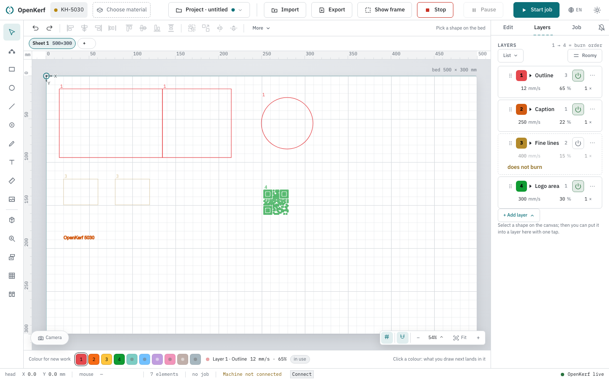
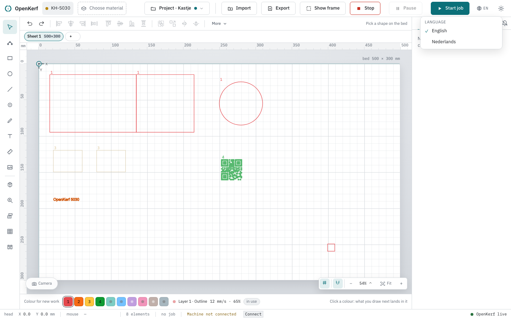
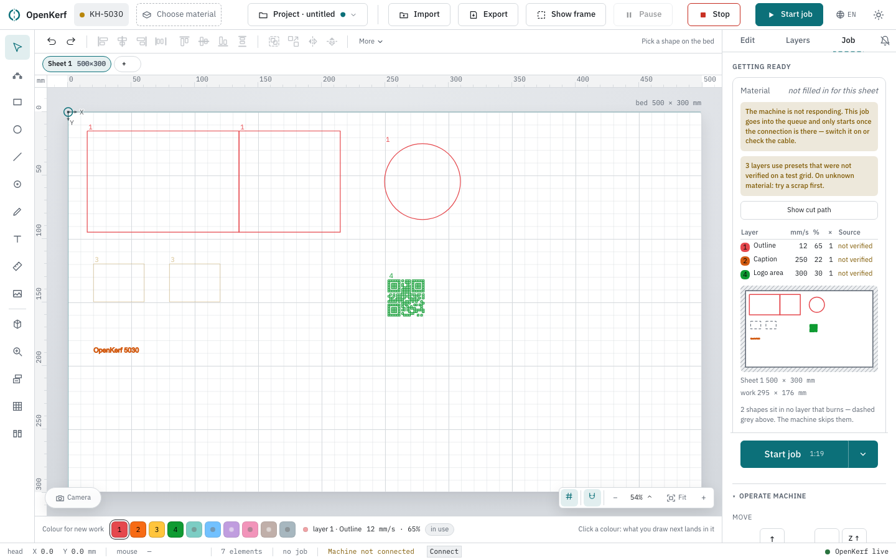

# Reference: shortcuts, actions and settings

This page lists every keyboard shortcut, every operation OpenKerf can perform on
your work, and the settings that apply to the whole app rather than to one
design. It is meant for looking things up, not for reading through.

Operations are not repeated per place: one list feeds the right-click menu, the
action bar above the canvas and the keyboard, so a name, a shortcut and the
reason something is greyed out are the same wherever you meet them. The last
column of each table gives the name OpenKerf uses internally — handy when you
report a problem, and ignorable otherwise.

## Keyboard shortcuts

The first notation is what a Mac shows, the second what Windows and Linux show.
OpenKerf writes the one that matches the keyboard you are on.

### History and clipboard

| Keys | What it does | |
|---|---|---|
| ⌘Z / Ctrl+Z | Undo | `undo` |
| ⌘⇧Z / Ctrl+Shift+Z | Redo | `redo` |
| ⌘X / Ctrl+X | Cut the selection | `cut` |
| ⌘C / Ctrl+C | Copy the selection | `copy` |
| ⌘V / Ctrl+V | Paste | `paste` |
| ⌘D / Ctrl+D | Duplicate the selection | `duplicate` |
| ⌫ / Del | Delete the selection | `delete` |

### Selecting

| Keys | What it does | |
|---|---|---|
| ⌘A / Ctrl+A | Select all | `selectAll` |
| Esc | Clear selection | `clearSelection` |
| Alt+click | Walk down a pile of overlapping shapes, one click deeper each time | — |
| ⌘L / Ctrl+L | Lock the selection, or unlock it when it is already locked | `lock` |

### Arranging

| Keys | What it does | |
|---|---|---|
| ⌘G / Ctrl+G | Group | `group` |
| ⌘⇧G / Ctrl+Shift+G | Ungroup | `ungroup` |
| ⌘U / Ctrl+U | Ungroup — the same operation on the key LightBurn uses | `ungroupAlt` |
| ⌘⇧H / Ctrl+Shift+H | Mirror horizontally, about the vertical axis | `mirrorH` |
| ⌘⇧V / Ctrl+Shift+V | Mirror vertically, about the horizontal axis | `mirrorV` |
| , | Rotate 90° anticlockwise | `rotateLeft` |
| . | Rotate 90° clockwise | `rotateRight` |

### Bridges

| Keys | What it does | |
|---|---|---|
| ⌘⇧B / Ctrl+Shift+B | Add bridges to the selection, four of 2 mm; on a shape that already has them, take them away | `bridges` |

Chrome uses this combination for its bookmarks bar, and unlike ⌘0 it does hand it
over: with the canvas focused the bar stays as it was and the bridges land on the
selection.

### The node tool

These work while the Nodes tool has a node in hand — click a knot on the shape, or
tab to it and press Enter.

| Keys | What it does | |
|---|---|---|
| ⇧I / Shift+I | Add a node halfway along the piece after this one | `nodeAdd` |
| ⇧U / Shift+U | Make that piece a curve | `nodeCurve` |
| ⇧L / Shift+L | Make that piece straight again | `nodeCorner` |
| ⌫ / Del | Remove the node — not the shape | `nodeRemove` |

Shift+U and Shift+L are Inkscape's own keys for the same two operations. Inkscape
adds a node with Insert; a Mac keyboard has none, so it is Shift+I here.

### Moving with the arrow keys

| Keys | What it does |
|---|---|
| ← ↑ → ↓ | Move the selection 0.1 mm |
| Shift + arrow | Move the selection 1 mm |

Both need something selected and a session that may write.

### Zooming

Bare digits, because the browser keeps ⌘0, ⌘+ and ⌘− for its own page zoom and
will not hand them over. Binding those would rescale the page instead of the
bed.

| Keys | What it does | |
|---|---|---|
| 1 | 100 % — actual size | `zoomHundred` |
| 2 | To the selection | `zoomSelection` |
| 3 | Fit everything in view | `zoomAll` |
| 0 | The whole bed | `zoomBed` |
| ⇧1 | Fit everything in view — the older key, still working | `zoomAllOld` |
| ⇧2 | To the selection — the older key, still working | `zoomSelectionOld` |
| ⌘⇧A / Ctrl+Shift+A | To the selection — LightBurn's key | `zoomSelectionLightburn` |
| + | Zoom in a step | `zoomIn` |
| − | Zoom out a step | `zoomOut` |

### Before a job runs

| Keys | What it does | |
|---|---|---|
| ⌥P / Alt+P | Open the **Cut path** window: the order, the travel and the clock | `cutPath` |

Alt+P is LightBurn's own key for its preview, and the browser hands it over — with
the canvas focused the window opens and nothing else moves.

### While a job runs

| Keys | What it does |
|---|---|
| ⌘ + . / Ctrl + . | Stop: abort the job right away. Pressed with nothing running, it aborts a job the moment one starts. |
| Pause | Pause the job, and press again to resume. |

None of the shortcuts fire while the cursor is in a field: in a measurement box
a full stop is a decimal point, not an emergency stop.

The pen tool has keys of its own while a line is under construction, and they are
its alone: Enter or a double-click finishes the line, Backspace takes back the
last point, and Escape throws the line away.

## The action bar above the canvas

The strip between the top bar and the drawing. Four groups of icon buttons,
separated by thin dividers, with a "More" button at the end and, on the right,
what is selected — "Pick a shape on the bed", "1 shape selected" or
"{n} shapes selected".

| Button | What it does | |
|---|---|---|
| Undo | Step back one edit | `undo` |
| Redo | Put back what you undid | `redo` |
| Align left | Line the selection up on its leftmost edge | `align-left` |
| Centre horizontally | Line up the horizontal centres | `align-centerh` |
| Align right | Line the selection up on its rightmost edge | `align-right` |
| Distribute horizontally | Equal gaps left to right | `align-spaceh` |
| Align top | Line the selection up on its topmost edge | `align-top` |
| Centre vertically | Line up the vertical centres | `align-centerv` |
| Align bottom | Line the selection up on its bottom edge | `align-bottom` |
| Distribute vertically | Equal gaps top to bottom | `align-spacev` |
| Group | The shapes move together from now on | `group` |
| Ungroup | Undo a group, so the shapes move on their own again | `ungroup` |
| Mirror horizontally | About the vertical axis. Clicking again puts it back. | `mirrorH` |
| Mirror vertically | About the horizontal axis. Clicking again puts it back. | `mirrorV` |
| More | Opens the menu a right-click would open in the same state: the selection's rows when something is selected, the design's rows when nothing is. Its tooltip reads "All operations — or right-click a shape" | — |

The eight alignment buttons also sit together in the right-click menu, under
"Align and distribute" (`align`), as two rows of four.

## Right-click on a shape

The order is the order of every desktop application: the clipboard first, then
arranging, then the shape itself, then where it belongs, and only at the bottom
what throws it away. A misplaced click here hits "Copy", not "Delete".

### Under the pointer

| Row | What it does | |
|---|---|---|
| Under the pointer | Appears only when more than one shape lies under the click. Lists them by name, size and stacking order, with a tick on the one you have; picking a row selects exactly that shape. | `under-pointer` |

### Clipboard

| Row | What it does | |
|---|---|---|
| Cut | Take the selection off the bed onto the clipboard | `cut` |
| Copy | Put a copy of the selection on the clipboard | `copy` |
| Duplicate | A copy straight onto the bed | `duplicate` |

### Arranging and rotating

| Row | What it does | |
|---|---|---|
| Align and distribute | The eight buttons above, as a grid of icons | `align` |
| Group | The shapes move together from now on | `group` |
| Ungroup | The shapes move on their own again | `ungroup` |
| Mirror horizontally | About the vertical axis | `mirrorH` |
| Mirror vertically | About the horizontal axis | `mirrorV` |
| Rotate | Submenu with the three turns below | `rotate` |
| 90° anticlockwise | A quarter turn to the left | `rotate-left` |
| 90° clockwise | A quarter turn to the right | `rotate-right` |
| 180° | Upside down | `rotate-180` |

### Combining shapes

Under "Combine" (`combine`). The result is one path; the shapes that went into
it disappear.

| Row | What it does | |
|---|---|---|
| Union | One outline around everything | `bool-union` |
| Difference | The later shapes taken out of the first | `bool-difference` |
| Intersection | Only what all of them cover | `bool-intersection` |
| Exclude | Everything except where they overlap | `bool-xor` |

### Editing the path

Under "Edit path" (`path`).

| Row | What it does | |
|---|---|---|
| Offset… | A new path beside the existing one, at a distance you type; the original stays | `path-offset` |
| Simplify | Fewer points for the same line | `path-simplify` |
| Nest | Pack the selection close together to save material | `path-nest` |
| Split into separate shapes | Break one path into its loose pieces. When it can, the row counts them: "Split into 4 shapes". | `path-split` |
| Hatch | Fill the shape with lines to burn | `path-hatch` |
| Wobble | Give the line a wobble as it burns | `path-wobble` |
| Remove duplicates… | Looks for shapes lying on top of each other and says how many there are before anything goes | `path-duplicates` |

### The shape itself

| Row | What it does | |
|---|---|---|
| Corners… | Round or chamfer, with the preview beside it | `corners` |
| Make a stencil… | Finds the parts a cut-out would set loose — the inside of an O — and bridges them to the sheet. Two settings, and the window says how many islands it found and how far the shortest bridge has to reach | `stencil` |
| Add bridges (4 × 2 mm) | Small gaps in the cut, so the part stays in the sheet instead of dropping into the machine | `bridges` |
| Remove bridges | The same row on a shape that has them: the cut closes again and the part comes loose | `bridges` |
| Fill — for rastering | A raster layer then burns the area instead of just the outline | `fill` |
| Remove fill | The same row on a shape that already has a fill: without a fill a shape only rasters its outline | `fill` |
| Edit text… | Only on text: change the words, the font and the size | `text` |
| Insert a column | Only on text: a submenu with a row per column of the attached list, each labelled with the column's own name; picking one appends its placeholder to the text. With exactly one column there is no submenu and the row is that column, reading "Insert {column}". Greyed without a list. | `insert-column` |
| Burn only once | In a series this shape burns on the first plate only — a jig frame, or the pockets the pieces sit in | `burn-once` |
| Burn on every plate | The same row on a shape already marked: it goes onto every plate of the series again | `burn-once` |
| Crop | Only on an image: then drag a frame over the image | `crop` |
| Undo crop | Only on an image you cropped: the whole picture back | `uncrop` |
| Vectorise | Only on an image: turns the image into paths | `vectorise` |
| Lock | Protects the shape from moving, sizing and deleting (⌘L) | `lock` |
| Unlock | The same row on a locked shape: it can be dragged again | `lock` |

### Where it belongs

| Row | What it does | |
|---|---|---|
| Layer | Submenu with a tickable row per existing layer — a shape may sit in more than one — and the three rows below | `layer` |
| Only in the cut layer | Put it in the cut layer and take it out of the others | `layer-only-cut` |
| Only in the engrave layer | The same, for engraving | `layer-only-engrave` |
| Only in the raster layer | The same, for rastering | `layer-only-raster` |
| Move to another sheet | Submenu of the project's other sheets; only there when the project has more than one | `sheet` |

### At the bottom

| Row | What it does | |
|---|---|---|
| Delete | Off the bed. Red, and never the first row. | `delete` |

## Right-click on the canvas

This menu is about the view and the whole design, not about one shape.

| Row | What it does | |
|---|---|---|
| Paste here | Paste at the point you right-clicked: "The top-left corner lands where you clicked". Away from a click point the row simply reads "Paste". | `paste` |
| Select all | Everything on this sheet | `selectAll` |
| Clear selection | Nothing selected any more (Esc) | `clearSelection` |
| Fit everything in view | Under the heading "View" | `zoom-all` |
| To the selection | Zoom to what is selected | `zoom-selection` |
| The whole bed | Zoom to the bed, whether there is work on it or not | `zoom-bed` |
| 100 % — actual size | A millimetre on screen is a millimetre on the bed | `zoom-hundred` |
| Snap to grid and shapes | On or off; the explanation reads "Hold Alt to skip it for one move" | `snap` |
| Layer numbers next to the shapes | On or off; the small numbers beside each shape | `layerNumbers` |
| Put everything on the bed | Pulls the whole design back inside the bed, "Including what lies off screen and cannot be clicked" | `rescue` |
| Show cut path | Opens the **Cut path** window: in what order the machine burns, where it travels without burning, and how the time builds up (⌥P) | `cut-path` |
| Set up a series | Opens the **Series** window: "Attach a list, see what every burn engraves, and choose where to start". The same door as the button on the tool rail; no shortcut. See [Variable text](variable-text.md) | `series` |
| Remove duplicates… | The same operation as in the shape menu, over the whole bed: opens **Shapes lying on top of each other** with the count in it | `canvas-duplicates` |

## Right-click on a node

With the Nodes tool active, a right-click on one of the shape's own points. It is
a menu about one point of one shape, so it has reasons of its own — see the table
of greyed-out reasons below.

| Row | What it does | |
|---|---|---|
| Add a node here | Halfway along the piece after this node. A double-click on the line puts one exactly where you click. | `node-add` |
| Make this piece a curve | The line stays where it is and gets a handle to pull it with | `node-kind` |
| Make this piece straight | The same row on a piece that is already curved | `node-kind` |
| Remove this node | Red, and at the bottom. It removes the point, not the shape. | `node-remove` |

## Right-click on a layer

The same menu opens from the "…" button on a layer row in the Layers tab.

| Row | What it does | |
|---|---|---|
| Select the 3 shapes in this layer | Selects them on the canvas, so you can see what is in the layer. The row counts them, and reads "Select the shape in this layer" when there is one. | `layer-select` |
| Put selection in this layer | Adds what is selected to this layer; on a selection already in it the row reads "Take selection out of this layer" | `layer-put` |
| Burns along | On or off; the explanation reads "Off means: this layer does not go to the machine" | `layer-burns` |
| Visible on the canvas | Show or hide the layer while drawing; the explanation reads "Changes nothing about the job" | `layer-visible` |
| Burn earlier | One place up in the burn order | `layer-up` |
| Burn later | One place down in the burn order | `layer-down` |
| Settings… | "Name, speed, power, passes, colour" | `layer-settings` |
| Choose a material preset… | Opens the material library with this layer as the target of **Apply**: "Opens the material library with this layer as the target, so one tap puts the speed and power on it." | `layer-material` |
| Remove layer | Red. "The shapes stay on the bed." | `layer-remove` |

## Right-click on a row in the material library

The **Material library** window has two lists and both of them carry the same **⋯** at the
end of a row, opening the same menu a right-click on the row does. They are not canvas
operations, so they are not in `actions.ts` and have no shortcuts; they are here because
this page is where you look up what a menu holds. The whole of it is on
[The material library](library.md).

On a setting:

| Row | What it does |
|---|---|
| Apply to layer {n} | Puts this speed and power on that layer. Reads "Apply" when there is no layer to name. |
| Provenance and evidence | Unfolds where the numbers came from, with the photo of the board — explanation "Where these values come from" |
| Adjust the values | Speed, power, line spacing, passes, thickness, note and machine profile. Material, operation and source stay fixed. |
| Make a test grid for {material} | Opens the test grid window with this material filled in |
| Share with Presetariat | Unfolds what this preset would go into the catalogue as — a measurement or a starting point, and why — asks for your GitHub handle the first time, and then opens a pre-filled proposal in a new tab |
| Remove preset | Red, and at the bottom. Asks under the row, and says when the preset was measured. |

On a material:

| Row | What it does |
|---|---|
| Show only this material | The same narrowing as the checkbox in the header |
| Make a test grid | Opens the test grid window with this material filled in |
| Rename this material… | The name, and the other names it answers to |
| Merge into another material… | Moves the presets, boards, recipes and photographs onto another material |
| Remove this material | Red, and at the bottom. Counts what would go before it asks. |

## When an operation is greyed out

A grey button always says why, in its tooltip — and that is now true of every control in
the app and not only of the rows in the menus. It was true of 91 of the 180 before this
round; the other 89 went pale and said nothing, which the code itself calls a riddle.

Two of the reasons below carry most of them: "Another operation is still running" while
an edit is on its way back, and "Requires a token" for a session that may not write.
These are all of them:

| Message | What to do |
|---|---|
| Requires a token | Fill in the token in the Job tab — see below |
| Another operation is still running | Wait a moment; the previous edit has not come back yet |
| Pick a shape first | Nothing is selected |
| Select at least two shapes | Aligning, grouping and combining need something to work between |
| Distributing needs at least three shapes | Two shapes have no gap to spread |
| This selection is not in a group | Nothing to ungroup |
| This shape is a single piece | There is nothing to split |
| Nothing is on the clipboard | Copy or cut something first |
| Nothing is selected | For clearing the selection and zooming to it |
| Nothing is on the bed | For select all, fit in view and putting everything on the bed |
| This layer is empty | There are no shapes in it to select |
| This layer already burns first | It cannot move up |
| This layer already burns last | It cannot move down |
| This layer belongs to a test grid | A test grid's layers are evidence; they are locked |
| A line, text or an image carries no bridges | Bridges work on a rectangle, an ellipse, a polyline or a path |
| No list is attached in the Series window | Inserting a column needs a list to take it from — attach one first, see [Variable text](variable-text.md#the-list) |
| Click a node on the shape first | The node operations act on one point; click a knot to take it in hand |
| This is the last node; there is no piece after it | The end of an open line has nothing leaving it to bend or divide |
| A closed shape needs three nodes | Removing this one would leave no shape behind |
| A line needs two nodes | The same, for an open line |
| Make a layer in the Layers tab first | Applying a preset needs a layer to put it on |
| No connection to OpenKerf — this button will not arrive. | The app cannot reach its own server. Everything that would write is off until it is back; selecting, dragging a node, measuring and zooming keep working, because they need nothing from it |
| Type a name first | The field above it is empty |
| Type the text first | A QR code, a barcode and arc text are made out of a text |
| Type at least two letters to search | For the clipart search |
| Pick a material first | Merging needs the material to merge into |
| There is nothing here yet | The list, the choice or the picture it works on is still empty |
| The photograph is still being read | The board is being looked up from its code |
| Nothing has been fetched yet | The answer this button acts on has not come back |
| Fill in a speed and a power first | A preset by hand needs both numbers |
| Nothing in this shape would fall out, so there is nothing to bridge | For the stencil window |
| There is only one material to merge | Merging needs a second material to merge into |
| Not possible while a job is running | The machine is busy; sending it a file has to wait until the job is done or stopped |
| This machine does not keep files in memory; that is a Ruida thing. | Sending a job to the machine's memory is something only a Ruida controller does |
| There is nothing to burn | Nothing is in a layer that burns, so there is no job to start or to send |

A refusal that only shows up after you press is a different thing, and it is a
whole sentence rather than a tooltip. The ones for sending a job to the machine's
memory — a transfer that stops halfway, and what is then left on the panel to
delete — are written out in [Burning](job.md#sending-the-job-to-the-machine).

On the tool rail the same rule applies with its own wording: a tool you cannot
use reads "{name} — requires a token", and every tool except Select is off
without one.

## Language

The globe button at the right-hand end of the top bar, next to the theme switch,
with the two-letter code beside it. It opens a short menu headed "Language":
English and Nederlands, each spelled in its own tongue, with a tick on the one
you are in.

The choice takes effect at once and is remembered in this browser. Without a
choice OpenKerf follows the browser's own list of preferred languages and falls
back to English, which is the source language and therefore always complete.

Numbers and dates change with it: 3,5 mm in Dutch, 3.5 mm in English. Names of
materials, layers and sheets do not — those are your words and stay as you typed
them.

## Light and dark

The sun button at the far right of the top bar, tooltip "Switch theme". It
flips the whole window between the light and the dark palette, and nothing else
changes with it. Dark works but has not been measured as carefully as light; if
something is hard to read there, the light theme is the one to trust.

## Notifications

The bell beside the panel tabs on the right. It carries its own state: crossed
out means off or blocked, so you can see it without clicking. Its tooltip reads
"Notifications are on" or "Notifications are off". Clicking it opens the
Notifications window.

In the window:

- A switch, "Tell me when a job finishes or gets stuck", with the line "Even
  when this tab is in the background."
- What the browser makes of it, in one sentence: "The browser has not been asked
  yet.", "The browser may show notifications.", "The browser blocks
  notifications for this site." or "This browser cannot show notifications."
- The button "Ask for permission" while the browser has not been asked, and
  "Send a test notification" once permission is there.
- The last notification, with the time it was sent, and the note "(not shown as
  a pop-up: the screen was on, or notifications are off)" when the browser kept
  it to itself.

OpenKerf asks the first time there is something to report — while a job is
running, not before — with the question "Shall I tell you when this job is
done?" and the buttons "Not now" and "Turn on notifications". Saying no here
costs nothing: the browser is only asked after a yes, and you can turn it on
later in the Notifications window.

What arrives: the job is done, the connection dropped during a job, and the
progress counter has stopped moving. The window ends with the limit, in the
app's own words: "OpenKerf reports, but does not intervene: there is no flame or
smoke detection. The camera hangs off the computer and not off the machine, so
we cannot see whether something is going wrong in the bed. Stay near a running
job."

**When it goes wrong.** If you once refused the browser's question, the switch
stays off and cannot be moved, and the window says what to do: "Click the
padlock or the ⓘ sign on the left of the address bar, set Notifications to
Allow, and refresh this page. On a phone it is under the browser's site
settings." A notification the browser then swallows is reported as "The browser
refused to show the notification. With an installed app it often helps to open
it again."

## The token for write actions

When the OpenKerf server is reachable from your network it asks for a token
before anything may change or move. Until it has one, the app is read-only:
drawing tools are off, edits are refused, and the machine will not budge.

The field is in the Job tab, at the top, labelled "Token for write actions",
with the hint "The engine logs the token when the API starts." Paste it, press
Save, and the tools come to life.

**When it goes wrong.** A token the server does not accept turns the label into
"This token is being refused" and the hint into "Look in the window the engine
runs in: that is where the token for this server is printed." The field stays,
so you can put a different one in. Elsewhere a blocked edit reads "No token, or
the wrong one — editing is blocked."; the machine buttons say "Fill in a token
first"; the tool rail says "{name} — requires a token".

## The rotary

Not an app-wide setting but a machine-wide one, and this is where people look for
it: **Machine → Your machines → Rotary**, per machine. It holds the switch **Burn
on a cylinder**, the kind of rotary with its diameter or circumference, the Y
scale, a calibration from a burned line, and the ten steps to work through at the
laser. While it is on, homing is refused and the pre-flight says the rotary is on
before every start. The whole of it is on [The rotary](rotary.md).

## What kind of laser it is, and how strong

Machine-wide as well, and asked once: **Machine → Your machines → Settings**, under the
fieldset **The laser itself**. It holds **Kind of laser** — "CO2 with a glass tube", "CO2
with an RF metal tube", "Diode", "Fibre", "UV" or "I do not know" — the **Tube power** in
watts, with the tick box "I am not sure how powerful my tube is" as a real answer, and the
**Lens** in mm. The wizard asks all three on its **Set up** screen; the material library
offers the same three for the machine you are on.

They decide one thing: which presets measured on somebody else's laser can be a starting
point for yours. Without them nothing matches at all. See [Getting
started](getting-started.md#setting-up-the-machine) and [The material
library](library.md#starting-points-from-the-shared-catalogue).

## The camera

Only there when a camera is attached: a pill at the bottom left of the canvas,
reading "Camera". Clicking it starts the picture and lays it over the bed;
clicking it again stops it. Two more controls appear while it is running:

- A slider, "Camera image opacity", from a faint overlay to the full picture.
- "Calibrate", or "Recalibrate" once it has been calibrated before.

With more than one camera attached, the calibration window has a **Camera**
drop-down at the top: choosing another one switches the picture over. With one
camera there is no chooser, because a choice of one is not a choice.

If the picture stops arriving while the camera is running, the phone falls back to a
still that refreshes every two seconds rather than to a broken picture.

Calibrating opens the window "Calibrate the camera" over the raw picture:
"Drag the four points to the corners of the bed, starting top left and going
clockwise. After that the app knows where every point in the image lies on the
bed, and your design lands in the right place." Buttons: "Clear the
calibration", "Cancel" and "Save".

The camera needs a token like every other write action; without one the pill is
off and its tooltip reads "Requires a token". A camera that will not start
reports the reason in its own line above the pill, which you can dismiss.
